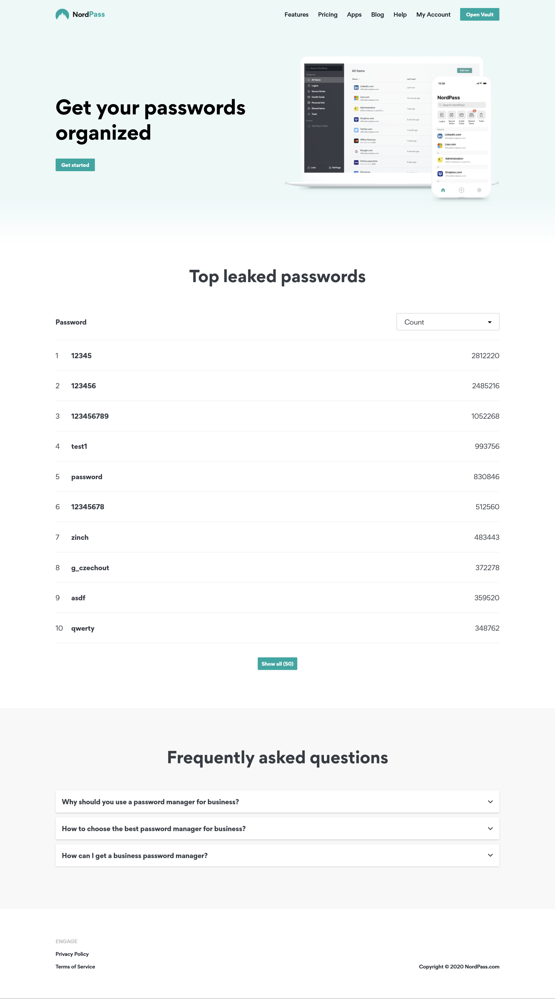

# Project Title

Nordpass page

# Demo link:

Access this site at https://jurgitaesu.github.io/nordpass-app

# About the App

This app is a single page representing a Nordpass page design. It fetches most popular leaked passwords.

# Screenshot

# Technologies

App was created with React JS and TypeScript. Sass preprocessor and BEM methodology were used for styling.

# Setup

- download or clone the repository;
- run `npm start`;
- Open [http://localhost:3000](http://localhost:3000) to view it in the browser.
